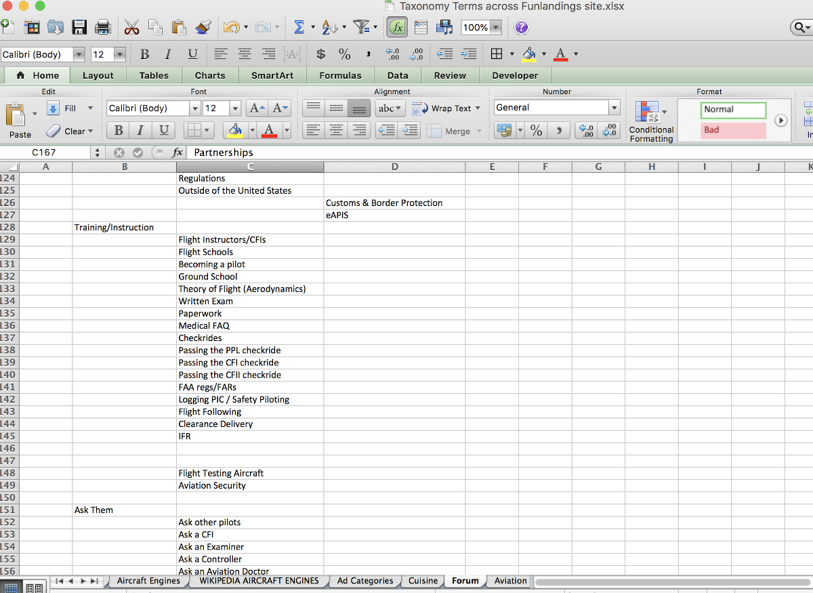

# Multi-section Forum

 

## Creating a multi-section Forum:

The easiest thing to do is to set up what you think is the most logical structure for your forum in an excel spreadsheet.  What you want is a top or parent level that in Drupal Forum will be the “Container level”.  Then below that you put in the actual forum subjects that fit in that group.  This way you can move stuff around real easily until you get structure logic that you are satisfied with.  You can then just copy and paste from Excel to Drupal as you built it out.

While the Forum module is part of Drupal CORE, remember you need to activate it by putting a check mark next to it under ‘Extend’ in the administration menu and install it.  Once you do, if you look under ‘Structure’ in the administration menu it will be on this list toward the bottom [alphabetically].

When you click on it you have the option of adding a ‘Container’ or a ‘Forum’.  The ‘Container’ is the parent level you want to group ‘Forum’ topic areas under.  Just for smoothness of entering stuff and the ‘drag and drop’ alignment of how they fit, it works best to start with the last [alphabetically] container and end with the beginning of the alphabet.  [ otherwise you drag the most recent entry you made past all the other stuff during a drag and drop and it gets messy to do.]

We you click the ‘Add container’ button it gives you a typical Drupal screen.  All you really need to do is put in the name.  The other stuff is optional and I think it is cleaner not to bother with at the container level.

When you click the ‘Add forum’ button it looks very similar and again you only need to fill in the Name.   However, with the specific Forum entering a description kind of helps tell people what they should put in that specific topic area.

The set up area looks like this when you start getting it organized.  What you are doing is dragging the ‘Container’ levels up and down to where you want them.  And within each Container you then drag and drop in the Forums you want in that category [remembering to drag the ‘indented’ to establish your organized hierarchy]

The result of what you have done will start to look like this.  However, you won’t have the different color bands unless and until you have applied some CSS styling.

If you look at the TWIG templates that drive the Forum, you will find that they assign ‘even’ and ‘odd’ classes to every other table row.  So you can just use CSS class selectors against those classes and apply your background-color choices.

The problem is, that the forum areas I want my site to have produces an extensive list; so much so, that the user would have to scroll through tons of forum topic areas to find what is of interest to them.  Therefore, we need a way to ‘jump’ to the general area (Container) that has the more specific topical forum they would want.  To do that we recreate a new menu; adding the “Available Forums” menu to the standard list and when we add it, putting “The container sections of the master forum” in the description field so we remember how we want the jumps to be set up.

It pays to have written down or recorded your ‘Container’ level names because you have to enter them [or copy/paste from your Excel file] as you add menu links.

Of course your new menu can’t be found on your web site pages because just creating it doesn’t “place it”.  Thus under your administration menu you need to click on the ‘Structure’ tab and on the top of that list is ‘Block layout’; which you click to open what essentially shows you the names of the sections in your theme and what is in each section.  If you want your little forum mini-menu to be seen in the sidebar first section you click the ‘Place block’ button, scroll to find it, and place it there.

Pretty cool, there it is.

Of course yours doesn’t quite look like that because you didn’t add the statement in the forum.css file you created to make container levels a different background color; see that and the font-size and color we will see in later versions.

We sort of have another problem with the new mini-menu we created and that is that while we told the ‘Block layout’ system where we wanted it to show up we didn’t tell anything the when.  We can start by tell the system to ‘Configure block’ so it doesn’t show up in Articles, Basics pages, or other content types we may have created; only in the ‘Forum topic’ content type by placing in a checkmark next to it.

Note the addressThe thing is, we actually need to be a little more specific or that mini-menu block will only show up at the top of the overall forum; and if a user has used it to ‘jump’ to a “Container” section, they will feel sort of like they are floating lost way down the list of forum section.  If you scroll down your list and stop and click on a ‘Container’ section you will find what the ‘/forum/??’ node number address of that location; the location you want your users to jump to when they click the mini-menu title of the same name.

So now, you can go into that ‘Block layout’ again, scroll down to where you placed the new menu you put in called ‘Available forums’, and click on the ‘configure’ button.  It will open back up the area where you selected the content type you wanted your mini-menu to show up but below that you will see a ‘Pages’ visibility option and you can insert the specific pages for each of the ‘Container’ levels you want your mini-menu entries to jump to.

Note the address

Not quite done yet.  We really kind of skipped over how you made entries in your mini-menu.  We said you used the same name for their title as you used for the ‘Container’ levels in your forum list; the “Menu link title” box in the ‘Add menu link.  But that matching name is really a user convenience and it doesn’t technically drive the jump to the correct place.  What does that is the “Link” box you need to fill in.

Note the address

Looks pretty good at the top level of the overall list of Forums.

Shows up when you are in a subsection of the Forum for each ‘Container’ level so the user has a feel where they are and can jump to next. [bread crumbs can also be used on the page to be helpful].

Another thing to make it potentially a little prettier but more so for consistency of ‘User Experience’ on knowing where they are in navigation is we might want to make our mini-menu background color the same as the ‘Container’ level background that it is driving the ‘jumps’ to.   We can add a little more to the Forum.css file to do that.  [I also wanted to make a ‘white’ title to my mini-menu box]

And the result is a menu that shows more consistency.

I didn’t like the “Add new Forum topic” button to show up at the top of the overall list of Forums; but, I obviously need to leave it so it shows up in the forums themselves so people can add content to the forums.  I looked at the code with the ‘Developers View’ of my browser and found out that the overall forum list had a forum_id=0 and used that in combination with the ‘class’ of the button to tell “Forum.css” not is display it [display: none;]

Now that button I didn’t want is gone:

Something else is different in my mini-menu too and you don’t see any CSS code driving it.  How did those ‘carrots’ get next to each Container mini-menu level.  Nothing magic, I just went back in the Block layout and selected my ‘Available Forums’ menu.

In there we see all the ‘Menu Link’ items have the carrot.

Still not magic.  Just click ‘Edit’ on each one to open it and in the ‘Menu link title’ put the carrot and a space in front of the title you have in there and save it.  [there are CSS commands you could use for various fancy symbols instead of this basic method if you want to go through the trouble].

You can get as fancy as you want with a bunch more CSS options.  I ended up centering the title of my mini-menu [and you can’t see if from a still shot, but it shifts back and forth a number of pixels to make it ‘dance’ a little to draw users attention.  There is a border around the mini-menu that you can see but what you can’t see without animation is that if also very slightly color shifts from the grey to the forum matching blue color to again further draw user attention to this as an ‘action’ menu.

Here is more CSS code that does the title dance and border color shift.  A couple other options are ‘commented out’ after I tried them and didn’t like them.  But left the code for others to consider.

