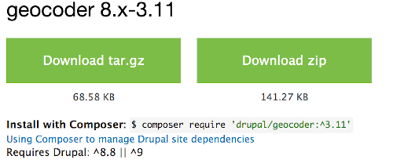
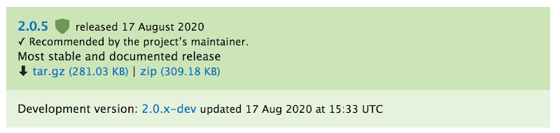
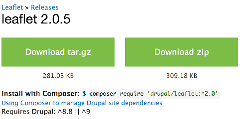
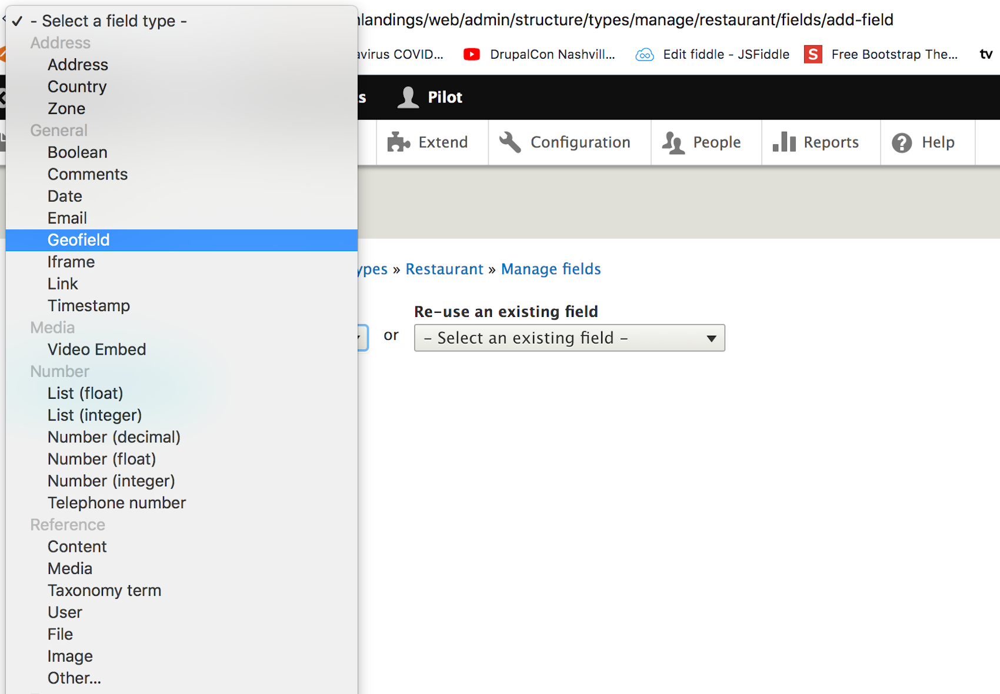
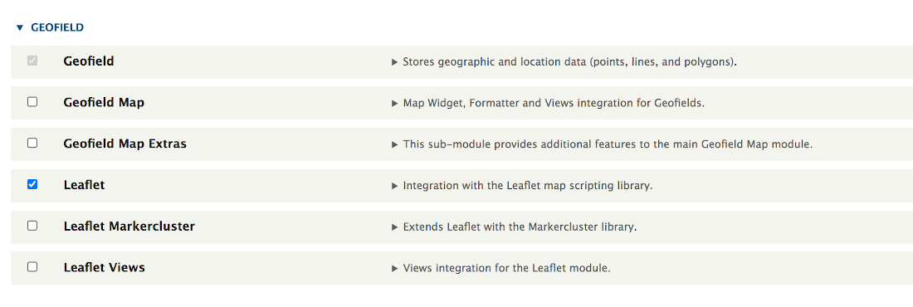
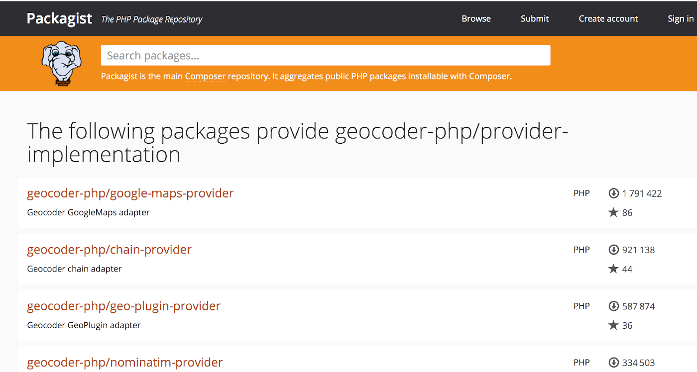
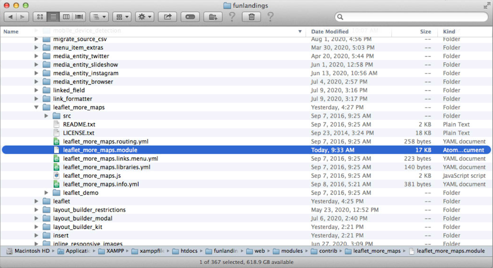
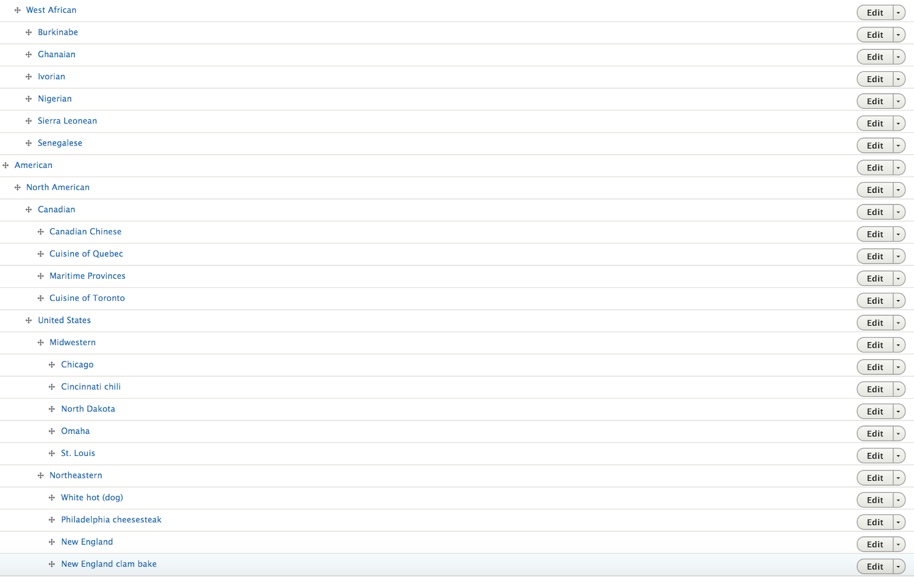

# Map in a Node
## Resturant Node Example
### Also shows taxonomy for the resturant node
This should be easily extended to other content types!

This outline offers a detailed, step-by-step installation and configuration of the modules you need to put a map on a node you build to present the locations of resturants that your site might feature.  The example also introduces one type of taxonomy that you might use to provide the opportunity for users to filter your resturant options by cuisine.  When you set up the resturant node, you will put information about each resturant in as you populate content.  A mandatory piece of content will be the 'address' because our mapping capability is set up so it grabs the address as the input it needs to draw the map.

## The basics should be in place 

- Drupal 8 or higher installed
- Views_UI and Field_UI enabled

There is a set of modules that work together to produce the desired end result.  This documentation shows installation of them sequentially rather than all at once so you can understand how they each work. 

### Modules involved

`composer require drupal/address` 
`composer require drupal/geofield` 
`composer require drupal/geocoder` 
`composer require drupal/geocoder_autocomplete` 
`composer require drupal/geofield_map` 
`composer require drupal/leaflet` 
`composer require drupal/leaflet_more_maps` 
`composer require geocoder-php/google-maps-provider` 
`composer require geocoder-php/bing-maps-provider` 
`composer require geocoder-php/arcgis-online-provider` 
`composer require geocoder-php/mapbox-provider` 
`composer require geocoder-php/open-cage-provider` 
`composer require geocoder-php/yandex-provider` 
`composer require drupal/extlink` 
`composer require drupal/taxonomy_manager` 
`composer require 'drupal/term_csv_export_import` 
`composer require 'drupal/entity_reference_tree` 
`composer require 'drupal/token` 

May need to install a minor patch depending if leaflet module update includes it automatically or not.
[See the issue](https://www.drupal.org/project/leaflet_more_maps/issues/2847024)

### The Modules Enabled
The assumption is that you have installed Drush already.  [If not](../modules/development.md#drush)<---
 
Then you can ‘enable’ the modules composer downloaded with the following Drush commands (or go to the Administration/Extend tool bar and click each one to install them manually) -

`drush en -y address geofield leaflet leaflet_views leaflet_markercluster leaflet_more_maps geocoder geocoder_address geocoder_field geocoder_geofield extlink taxonomy_manager term_csv_export_import entity_reference_tree token`

There is a [video by a guy from Iowa named Brian Webster that shows how](https://www.youtube.com/watch?v=u5xXaeh4ngU) the mapping part is put in place.  Watching it is an alternative to following these instructions (although this documentation picks up some of the other key things about the actual “Restaurant” content type like leveraging the sets of taxonomy important to it.

## Setting up the Mapping
 
### Start with the Geofield Module 

Using composer to get the module on your system site -

### Also get the Geocoder module

Again use the composer installation which coordinates dependencies 

### Install the Geocoder Autocomplete module

Again, installing with ‘Composer’ to coordinate dependencies

### Install the Geofield Map Module

Use Composer to install with dependency coordination 

### Install the Leaflet module 

Same deal, we install it using ‘Composer’

### Install the Leaflet More Maps module
Where it gets interesting and you might need to experiment with the options is after you add the Leaflet More Maps Module.  This module then brings in the configuration options for a whole variety of Map sources.  Google maps is a common source and the [video](https://www.youtube.com/watch?v=u5xXaeh4ngU) noted at the beginning shows it is a pretty accurate source.  But you do need to get a [Google Map API key](https://developers.google.com/maps/documentation/geocoding/get-api-key) to use it and it might cost you to run if you are mapping a bunch of page calls to your site.  Some of the other maps are free, offer different map styles, etc.  

As usual, install the module with the Composer approach to coordinate dependencies

Remember, that ‘installing modules’ to your site is a two-step process.  The first step is bringing them physically to your site and within your `composer.json` file as part of your site install on a physical server (or on a development/staging/production server in a coordinated way).  The second step is to go to your ‘Administration’ menu in Drupal and select the ‘Extend’ tab that shows all the modules physically present that you can activate.  All you need to do in the second step is checkmark the one(s) you want to activate and click the ‘Install’ button at the very bottom of the page -

Now lets use the mapping by creating a content type that benefits from it.  For example, having a map that shows where your restaurant is located.  Create a content type called Restaurant -

Then open that content type and add fields -

We had installed the address field as part of our starting point, so now add that field to the restaurant content type from the pull down list of fields -

There it is after you clicked on it and then say ‘Save and continue’ -

The address field has a bunch of options, that is why we installed rather than built it up from street, city, state, zip, etc. as individual fields we could have made/added.  One option is for what countries are available, and part of an aviation ‘app’ that could put your restaurant anywhere, we will leave it unchecked with keeps all.  We will also make the address field required, so people can find the restaurant, by check-marking the ‘Required field’ box --

We also have options for the address structure we would like.  In our case the name of the Restaurant is going to be the title of our content, so we will ‘hide’ the first name, middle name, and last name fields. Also hide the “Company” option because, again, the title of the node has the name of the restaurant.  I also remove or hide “Address line 2” .

There is an option to set a default country and I did United States.  This is NOT the same as the list of available countries that I left as all.  The default country is just how the field starts out unless you use the pull down to select a different one.

Now you have the standard body field and the Address field you saved -

Since you want that map, now we will leverage the Geofield by adding it to our restaurant content type -

Once you click on it, you will “Save and continue” to add it to your restaurant content type -

The fields in your content type have some configuration options under the “Widget” and for the Title,  we will make the size 60 characters and put an instructive placeholder in it of “Name of the Restaurant” so people know what to entry in the box -

Same deal on the body field, which we will make nine rows of text and with a placeholder of “General Description of the Restaurant”.  You can also set ‘Summary Rows” for say a teaser view option -

Add a “Phone Number” field from the standard field pull down list and give an initial order to your Manage Display.  If you look at that with just these modules installed, the Geofield with the ‘Raw Output’ format will show a Latitude and Longitude box.

No one knows there detailed Latitude and Longitude, so leaving it there would kind of suck.  Let’s install some modules so we can get that ‘Address’ field to drive the map placement.  So lets install the ‘Leaflet’ module next -

And now when we go back to the “Format” options on the Manage Display tab of the Restaurant content type we have a ‘Leaflet Map’ option in addition to the Lat/Lon.

Pick the ‘Leaflet Map’ option and see a map on your output as long as you put some Latitude and Longitude on your input in the Manage form display -

What you really want is not just to display the map from a Lat/Lon input on the Manage Form Display but to have the map driven by what a user puts in the ‘Address’ field you set up.  To do that you need the ‘Geocoder’ module installed along with the Address, Field, and Geofield elements that come with it -

Now when you go in to look at the Restaurant content type you set up, you find that Geofield you installed and click ‘edit’ to see the set up of the Geofield -

That edit opens the usual page but a little lower on it you see a box has been added for “Geocode” that you just added.  In that box mark the radio button saying “Geocode from an existing field” -

Since you already have the “Address” field in place, it will appear on the pull down list of available existing fields to ‘geocode’ from and you select it -

The Geocoder module needs to be configured to tell it what map “source” provider to utilize.  To do that you go to Administration/Configuration and find the Geocoder now listed in the System box as one of the options.  Click on that -

## The Map Provider

The Geocoder configuration shows two option tabs when opened -

Click on the ‘Provider’ tab to open up your options for where to source maps.  Then you want to use the ‘- Select –‘ box.  The list of options in that box may be very few until you install some; so don’t freak out.  See the note above the active provider list about using Composer to install providers and a link to a “list of all available geocoder providers”.  You want to click that link to get your select box list populated.  But don’t be surprised that the link takes you to “Packagist” (a PHP provider source) rather than Drupal; because other systems also use maps.  Remember that Composer is a PHP tool anyway, so it is straight forward to use it to install Packagist code modules.

The Packagist list looks like this.  And you can click on any provider to read more about their source and style.  They also typically tell you if an API key is required and where to get your key.  That will also lead you to know what, if any, charges might be involved. 

Google Maps is pretty common, so you might look in it.  You will see the typical Composer command filled out to just copy and paste so you can install that source provider -

After you install a Geocoder provider like GoogleMaps, and you ‘add’ it in Geocoder, you have some basic set up options.  The main thing is to put your API key in the box provided for that -

Here is Bing’s map Composer install -

Here is ArcGIS map Composer install -

Here is Mapbox Composer install -

Here is OpenCage map Composer install -

Here is Yandex map Composer install -

There are some potential accuracy differences in the sources.  The [video link](https://www.youtube.com/watch?v=u5xXaeh4ngU) referenced initially has some test results toward the end of the video that may be worth watching.

Once you have the map sources for ‘matching’ from the Address field installed so Geocoder has a way to pin the location, you still haven’t actually told the system what map source/style you want to “Display” on your Content type.  The easiest way to get there is to install-activate the ‘Leaflet More Maps’ Module -

I got a message like this when I installed the module:
`“Warning: Invalid argument supplied for foreach() in leaflet_more_maps_leaflet_map_info() (line 44 of modules/contrib/leaflet_more_maps/leaflet_more_maps.module).”`

[It had been reported by others on Drupal.org](https://www.drupal.org/project/leaflet_more_maps/issues/2847024)

Hope you didn't get the warning nor had the issue since the module may have been updated since.  But if needed, the patch noted as #8 worked.

It is a simple one to change. Jist open up the patch and look at the code.  Then open up the actual module and edit that line.  It is around line 42.

Once the ‘Leaflet More Maps’ module is installed, go back to your Content Type Manage Display and scroll to the Geofield where the little ‘wheel’ can be clicked for your configuration options.  Then you can use the pull down list to choose which map source/style you want to show.

There are also other configuration options you can set in that same area.  Like how big of a map you want to show, if you want to turn off the mouse wheel zooming (recommend so it doesn’t zoom as you scroll the location with your mouse).

You don’t typically want to tell the map to center on a Lat/Lon location because you are pulling the location from the address field instead.  But you do want to set the initial, min, and max Zoom levels.  

Now that we can show the Address, Phone number and a location map for our Restaurant, we want to add more.  Let’s put its website on the content type.  We go back to ‘Add field’ -

And we choose to add a “Link” from the pull down list -

But we want to control our link to the restaurant’s website a little more than the standard Drupal 8 link provides for and we elect to install the ‘External Links’ module to provide additional control --

We install with the Composer approach to coordinate dependencies -

We go into Administration/Extend and mark the checkbox to install-activate the module -

Once you install the External Links module you can go to Manage form display on the Restaurant content type and put a placeholder like http://plus your site’s address” in the box so users can know the expected format.

On the Manage Display tab tell it to open in a new window and ‘nofollow’ for security -

You want a way to describe your restaurants.  For this we use the taxonomy functionality available in Drupal.  Taxonomy allows you to create pick lists of classification terms to describe something.  For example, what meal occasions is the restaurant serving; breakfast through late evening.  As you set up taxonomies you are able to allow selection of only one or as many as the user wants to describe their restaurant.  We allow any because restaurants commonly serve at multiple occasions. 

We have a Dining Style taxonomy with options from Fine dining to food trucks -

If your have medical or religious or even just food preference reasons we want to know if a restaurant allows for Dietary Accommodations -

We also have a taxonomy for features the restaurant has -

The type of food a restaurant serves is called a Cuisine.  Since our restaurant content type is going to be used within an aviation site and people fly all over the world, we want it to accommodate local through detailed internationally unique food preferences.  There are 400+ Cuisines.  Too many to present as a long list to a users, so they are organized in a hierarchy -

If you have a painfully large taxonomy like the Cuisine listing, even the hierarchical organization isn’t easy.  So there is a module called ‘Taxonomy Manager’ that you can install to work with -

Use Composer to install Taxonomy Manager so its dependencies are coordinated.

Once installed, Taxonomy Manager is found under your Administration Menu, Structure tab, toward the bottom of the list alphabetically. 

Clicking on that structure option you will see a list of the Taxonomy vocabularies that you have created.  Or you can add new ones here as well. 

A relatively simple taxonomy like our “Restaurant Features” list, shows a nice list of checkboxes all at the same level.  You could make levels within it by something like having Parking at the top level and then subgroups like free, valet, remote underneath.

Our Cuisine taxonomy does have a hierarchy.  We have different styles of  Barbecue that we want subgroups for.  Same for Pizza styles.  But mostly, we need subgroups for various international or regional cuisines.  Asian is a good example.  Asia has Chinese, Japanese, Korean, Indian, Pakistani, Southeast Asian, and more.  There are all sorts of different Chinese and Indian regional cuisines.  And Southeast Asian has Thai, Vietnamese, Cambodian, and more.  So where there are subgroups, Taxonomy Manager shows an arrow you can click on to open up the subgroups.

Investing in developing, entering, and organizing a complex hierarchical taxonomy like Cuisines makes you want to protect it or make it available to other uses.  So you might want to leverage the ‘Term CSV Export Import’ module to pull the taxonomy up and down from a CSV backup file you perhaps work with Excel and a Text Editor.

The 8.x-3.0-alpha1 needs updating by the developer but did generally work.

You install it with the Composer approach for dependency management.

I posted an issue that the module gives a super long warning when I used it on the Cuisine taxonomy.  It did NOT have that issue with the shorter ones.

There is a back and forth between the developer and me.  So he knows about it for when he gets ready to work on updating.  But I indicated it was NOT a show stopper as the module actually worked, just had hundreds if not thousands of lines of warning before you could scroll down to the output on an export.

Once installed and activated the module can be found in the Administration menu, Configuration tab in the content authoring section.

When you click on it and go to the export tab you see options for the Ids, Header, and extra field; or to just output the straight CSV file.

Scroll to the bottom of where it exported (past any warning in pink/red if generated), and a box appears with the export.  Highlight it while scrolling through the full list and hit copy.  Then open your TextEditor where you will paste the output.  

The saved file will look something like this -

Developing, organizing, and backing up a complex taxonomy still doesn’t get you to the point of working with it in the Manage Form Display of the content type you will use it in.  So installing the ‘Entity Reference Tree Widget’ may be your answer -

The Composer install method again coordinates dependencies.

Then remember to activate the install in the Administration Extend tab -

Once the module is in place you will have a new Widget option for taxonomies you have in the Manage form display of the content type; select it -

A summary of what your Manage form display list option settings should look like after you have all this set up.

An example of what your Manage display configuration options set up should look like after you are done doing all this -

The above documentation will be added to once the airport master file is developed.  It is anticipated that the approach will be to somehow grab the airport code with the geocode closest to any node entry with a map and make an association of the node (restaurant, attraction, hotel, etc.)  via use of token matching.  For that reason, the Token module is included here as a likely install requirement.

It is also possible that a ‘routing’ logic for the combination of destinations into a tour will be needed.  Below is an approach where a developer outlines how they used a ‘polygon’ logic with mapping; in their case more to define a boundary rather than a route but it may give some ideas for approaches.: 

QUESTION: “Store values based on geographic data calculation (which polygon is a point within?) 
I'm hoping someone has advice on how do the following on a Drupal 9 site:
save address data (Address field seems best for this, I think.)
automatically geocode coordinates for the address (I'm not sure if geofield or geolocation field is best.)
define regions of a city, based on districts for local elections (I'm guessing I would store the polygons that represent the regions in geofield.)
as nodes with the address field are created (or imported or updated), check which region of the city each address is in and store that value (For example, store "district 6" in a text field if the point falls within that district. This is the step I am unclear on.)
That final step could be replaced with a dynamic query/view, but that would seem to be a waste since there will be thousands of nodes involved in many queries and the value of the district will remain static for years at a time.”
ANSWER: Here’s my setup for geographical data on my current project (D9) :
Address module + Geofield module + Geocoder module (and Geofield map for display) ; my entities uses External Entities but they could be nodes imported with Migrate/Feeds/custom solution if bulk insertion is needed.
I first import my geographical zones from biggest to smallest : region, counties, cities, neighbourhoods, cadastral sections, roughly 12k items. They are all from open data sources with a WKT/WKB string for geofield polygon data, along with labels and some relations between each. I index everything in Search API with Solr as a backend via Search API Solr, and Search API Location handles geofield data.
I programmatically use a view with JTS Solr Queries to do a isWithin search of the centroid of each polygon, giving me for each item its parent of each type.
When I import my cadastral parcel (polygons) and buildings (points), roughly 5M items, I use the same method to associate them to my zones : a direct entity reference and not a text field. I also do a reverse geocode since my source addresses are not clean.
So this is something doable, but I'd say it required some advanced drupal chops and a few prior geo/mapping skills to know what each module does and how they work with each other.
I have done this kinda thing since Drupal 6 and it still took me a few weeks of work to go from a few CSVs to a beautiful map with facets, per type styled polygons/points with nice labels, clustering, infowindows...
The final display of the map is where the rubber meets the road, you still have to build a car. that's why the ecosystem is multiple modules :
Geofield : provides field types and text formatters, to store and display location data (geojson, WKT/WKB, LatLon, X/Y, it uses the geoPHP to go from one to another ; storage in database is WKT)
Geofield Map : provides a map field formatter and views style to render a field value, multiple field value, or multiple entities via views results
Address module : provides a field type and text formatters to store and display addresses following the xAL standard (splitting address in parts like line1/2+city+postal_code instead of a giant textfield)
Geocoder : Allow an address field value to be converted to a geofield value and vice versa, address to lat/lon and lat/lon to text address

The Leaflet module works with/like Geofield Map to provides a map renderer using Leaflet and not Google Maps if I remember correctly, I tried it quickly when I didn't have a Google Maps API key so I could be wrong about its scope.
But since it still uses Geofield as the storage backend for geo data, it won't solve your issue which is determining which geofield value is contained is another geofield value.
But since your workflow and scale seems smaller than mine, an easier approach is feasible :
Create your content type(s) with a geofield field to contain your polygon
Create your zones by manually adding them, entering the geofield value like a Geojson or WKT string in the edit form. You should look for open data in your part of the world from official entities or open sourced, big areas are way easier to find and don't change as much as building and addresses.
Create your other content type that need to be geocoded, with a geofield field and a address field if you'd rather enter a text address and not a geojson/WKT.
The geocoder module is explicitly made to facilitate this workflow, its README and/or setting page should indicate how to set up this transformation
Create a custom module implementinghook_node_presaveto trigger the calculation on save :
Grab the current entity geofield value
Load your zones entities : if you only have a dozen of them, this should not be super slow which is why this whole technic works
Loop through them and grab their geofield value
If, and it's a big if, you have the GEOS-php extension installed with your PHP handler, you can use the within method
Otherwise use a non-GEOS library like geotools
Fill your entity reference fields with each zone

Something like :

Image

(This is napkin code done without IDE)
This should be a good pointer on what to do. I'll leave the display to you, with or without maps done by Leaflet/Google Maps.
Geo data management is fun and a rewarding "niche" of web dev, since you intersect with big data and much more hardcore people (you'll learn about PostGIS, coordinates system...) and non trivial JS libraries (Google Maps SDK or Leaflet). The Drupal ecosystem does a lot for you, but getting to display a nice map with lots of points is always so satisfying. Have fun !

