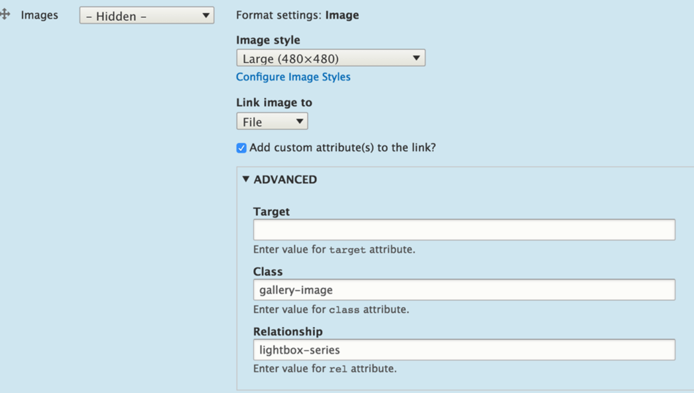
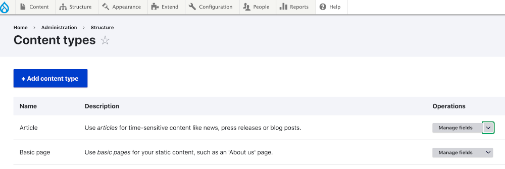
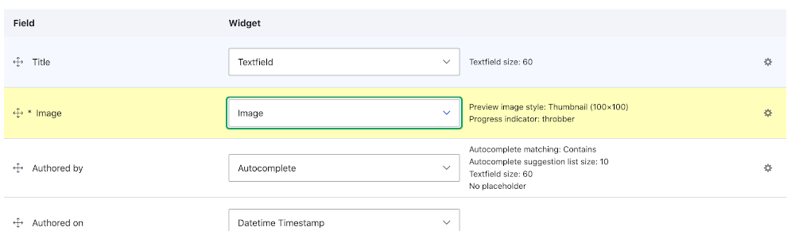
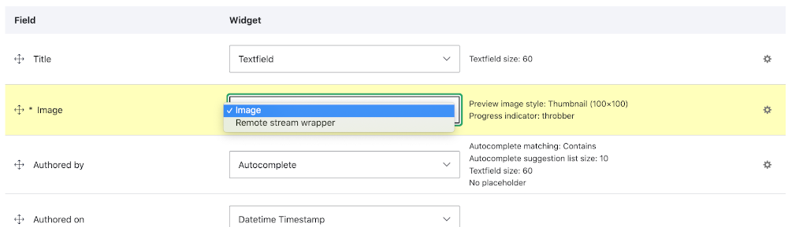
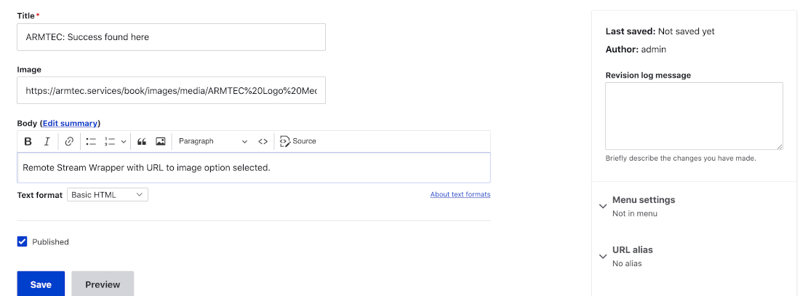
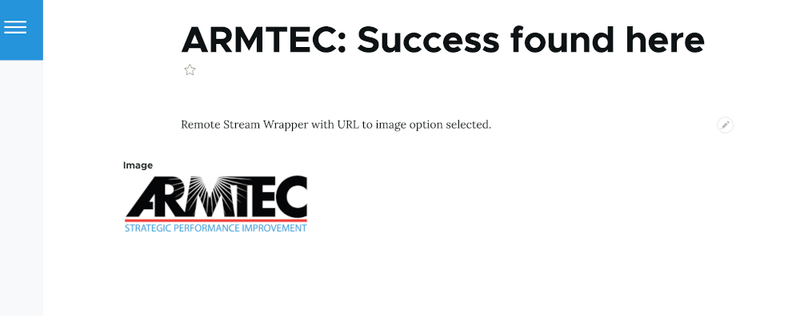

# MEDIA 

## Media Core

The most current versions of Drupal have upgraded Core to much more fully handle Media.  Go into your Administration/Extend option and check to see if the Media and Media Library modules have been enabled.  If not, do so.  Drupal provides a basic [overview of creating and configuring media content.](https://www.drupal.org/docs/8/core/modules/media/creating-and-configuring-media-types)

What this upgrade to Drupal Core has done is put support in place to link a piece of media into another content type of node.  Node is pretty much what you are working with when you use the article and basic page content types that were already present when you did your initial install. If you think of a typical website, it is extremely common that you would have a page or node of writing and a picture associated with it.  Media is broader than that in Drupal in that it also would include things like video, audio, and [a bunch of other social media type things from what they term media providers](https://www.drupal.org/node/2860796); that link taking you to Drupal's project site for a current, but techie looking, list.

In a big way, [the media management upgrade to Drupal Core has leveraged a few contributed modules that had become very popular for working with media.](https://drupalize.me/tutorial/overview-media-management-drupal)  Sometimes with Drupal it is worth re-plowing some old ground history to understand how things work.  The key here was a module called [Media Entity Browser](https://www.drupal.org/project/media_entity_browser) was in play and even now might goose up media management a step further than Core.  But what is important to understand about the history is that nodes, media, and other things are entities; so an 'Entity Browser' module underpins these.  Why you care is that there are modules beyond the upgraded media managment in Drupal Core that can [link together these other types of media.](../modules/entityref.md)

One of the best presentations on [Media Libraries in Drupal](https://www.electriccitizen.com/citizen-blog/media-libraries-drupal-8) is a must read for full appreciation of all that can be achieved.  It walks through creating Media Bundles, Library Views, Image Styles and Responsive Images, Display Modes, Entity Browsers, Adding Media Fields to a Node, and WSIWYG Embedding media with your editor.  To do all this it recommends installing the following modules; but note that some are now simply in Core and others get installed because of a dependency the other have on them.

 

Entity Browser (Now part of Core) 
Media Entity (Now part of Core) 
Media Entity Image (Limited Version update) 
Media Entity Document (Now part of Core) 

 

##### Responsive Images in Drupal
-  [Responsive Images In Drupal Guide](https://mariohernandez.io/blog/responsive-images-in-drupal-a-guide/) 
-  [Responsive Image Styles](https://mariohernandez.io/blog/responsive-image-styles/) 
-  [Art Direction for Images](https://mariohernandez.io/blog/art-direction-using-the-picture-html-element/) 
-  [Easy Responsive Images module](https://www.drupal.org/project/easy_responsive_images) 

 

### Taking it hands-on

[Managing Media Assest Using Core Media](https://www.webwash.net/managing-media-assets-using-core-media-in-drupal/) 
And 
[Using the upgraded Drupal Media and Media Library](https://imagexmedia.com/blog/drupal-media-and-media-library-guide) 
Or, if you prefer 
[a video on Drupal Media and Media Library](https://www.youtube.com/watch?v=NDR5VLSlSuQ) 

 
 

## Media extras

[Inline Entity Form](https://www.drupal.org/project/inline_entity_form) 
[Entity Embed;](https://www.drupal.org/project/entity_embed) but watch Limited Version update 
[Video embed field](https://www.drupal.org/project/video_embed_field) [Views Infinite Scroll](https://www.drupal.org/project/views_infinite_scroll) 
[Ctools](https://www.drupal.org/project/ctools) 

 

### Focal Point Module

The [Focal Point module](https://www.drupal.org/project/focal_point) is best thought of as an option for image cropping.  If you are at all artistic you know you want to emphasize the subject.  So when you crop an image you don't want to just randomly chunk parts off or a fit, you want the fit to optimize around the focus point of the subject of that image.  This module is how you do that and it integrates nicely with the rest of the core's media management. 

`composer require drupal/focal_point` 
`drush en focal_point`

### Image Link Attributes module

The [Image_Link_Attributes module](https://www.drupal.org/project/image_link_attributes) allows you to not only set links from an image but to use it to set CSS classes you can then style and set target attributes for the link. 

`composer require image_link_attributes` 
`drush en image_link_attributes`

### Fitvids module

The [Fitvids module](https://www.drupal.org/project/fitvids) is what you need if your want to make videos on your website be responsive for better appearance across devices. 

`composer require fitvids` 
`drush en fitvids`

### Media Directories module

Drupal core media management, with its library, is probably all you need to start.  However, if you have a site with a ton of media, the [Media Directories module](https://www.drupal.org/project/media_directories) may be just what you need.  A key feature it includes is a directory logic for your media assets.  When I start out with a few images I am fine scrolling through looking for them but when I start getting lots of them I use image subdirectories specific to the nature of the content they associate with.  Here is the solution. 

`composer require drupal/media_directories` 
`drush en media_directories`

### Media Video Micromodal module

The [Media Video Micromodal module](https://www.drupal.org/project/media_video_micromodal) is something you might find very powerful for some video presentation elements you want on your site enhancing, rather than dominating a page.  It hasn't been wildly popular yet but that could be that people find its many options intimidating to set up.  However, the level of control you have in how you link, assign CSS classes, manage the display size and location, should be welcomed.

### Media Bulk Upload module

The [Media Bulk Upload module](https://www.drupal.org/project/media_bulk_upload) is something you might want to leverage if you have created a new website and have all sorts of image, video, or other media type assets that you want to load to the website.  Dance carefully with this one in the sense it uses a [DropzoneJS module](https://www.drupal.org/project/dropzonejs) that is all about JavaScript and requires a few extra steps in installing. Let's say you had an old site in developed in some other way or real old version that you want to rebuild with the most current Drupal version and enhance it as well.  This might be a use case where you can come up with a file naming strategy and directory structure to organize and house the asset you want to grab and repurpose.  Then this module might come in handy.

### Remote Stream Wrapper modules

The [Remote Stream Wrapper module](https://www.drupal.org/project/remote_stream_wrapper) might be thought of as similar to what the standard media type of playing a remote video does.  Instead of having a local copy of an image, or for that matter any file type, the remote stream wrapper allows you to point to its URL location.  You know how you can Ctrl-Click an image on a Mac and select from a list of options including "Copy Image Address", well that address is what you would paste in for calling a remote image to your site. 

### Remote Stream Wrapper Widget 

The [Remote Stream Wrapper Widget module](https://www.drupal.org/project/remote_stream_wrapper_widget) is an add-on to the base module that makes it so you can get to the functionality through the Drupal Administration User Interface.  

### Installing these two modules

You won't find any significant level of documentation on how to use these modules; [Here is one.](https://danlobo.co.uk/articles/getting-started-remote-images-drupal)  A more direct 'how to' is provided here to get you going.  You install with composer as usual and you can enable the modules with drush or can go to the 'Extend' option from the Administrative menu to enable them.

composer require 'drupal/remote_stream_wrapper' 
drush en remote_stream_wrapper

composer require 'drupal/remote_stream_wrapper_widget' 
drush en remote_stream_wrapper_widget

From the Administration menu select an entity bundle you want to apply it to, most commonly go to the 'Structure' menu and select 'Content Type'.  Then you can either use one of your existing content types or add a new content type.  Using the example of an existing one, you see over on the right-hand side the Operations title has 'Manage fields' showing but the little down arrow means there are more things to select; if you know you already have an "image" field in the content type you want to work with, go directly to the 'Manage form display' option.  Otherwise first use the 'Manage fields' option to add one.  

In the 'Manage form display' option you want to find that image field and under the "Widget" section you will see a box with the word "Image" in it, plus a down arrow.

When you click the down arrow you will find the "Remote Stream Wrapper" option, click it.  Then go down to the bottom of the page and click save.

In the 'Manage display' option if you go down to the "Image" field and look at the "Format" column you will see "Image" showing but with a down arrow; which when you click shows you also have the option of displaying the 'URL to image'.  After making your choice again make sure to SAVE. 

Now go back to the top Administration menu and select the 'Content' option; from it pick the content type you set the Remote Stream Wrapper to work with and open it.  There you will see a typical look of that content type but in the "Image" field box you will be able to insert a URL to link an image remote from your site.  

Set the content selection entries all up, hit Save, and go see you have the image.

The Remote Stream Wrapper will also present similar options in the Media and Media Library modules part of Drupal Core but which need to be enabled to use.  You will even find in the Media Library that once you set up a remote image asset, a thumbnail of it will appear even though the image itself is remote.  This is convenient for content editors who probably don't give a darn where the image physically is located, simply want it looks like to grab and use.

 
 
 

[Learn More - Drupal Modules List](../chapters.md#drupal-modules)

