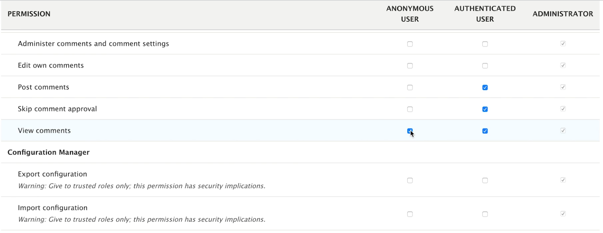
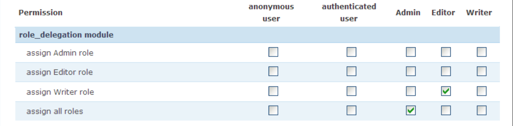

# Users, Roles, Permissions

At the first level, understanding Users and their Roles is straight forward.  If you set up your Drupal website you are the "Admin" or "Administrator".  By default you will also have an "Authenticated User" who is someone who signed up for your website and an "Anonynous User" who just dropped in.
You obviously want to be able to do anything you darn well want as the "Administrator".  You may not let the "Anonymous Users" in the door.  And "Authenticated Users" get to see stuff but perhaps not do some things like change other people's passwords, insert content without oversight, etc.  Thus, each "Role" has differing "Permissions". 

You get to all the stuff behind this by going to the People option in the Administration menu.

Once you are in there, you can list the roles that are already set up; or add others.   Plus, you can look at and set Permissions. 

The way to set permissions is to go down the list of all the stuff functioning in your website and put a checkmark in the box under each role if you want that role to be able to do that.   There is a ton of stuff you can adjust right from what is in the core of Drupal; and, as modules are added for more functions you might want to incorporate, your list will grow in terms of what you can grant to who.

## Know more

Don't reinvent the wheel if someone else has done a great job already.  Here is a series by Webwash on [what users, roles, and permissions are plus how you can manage them.](https://www.webwash.net/courses/drupal-site-building-masterclass/l/create-and-manage-users/)

## Do more

### Custom Permissions module

You can give permissions to individual pages on an exception basis.  The [Custom Permissions module](https://www.drupal.org/project/config_perms) uses the 'route' for the page you want to do this too.  Don't let that throw you.  A route is just like a path in a sub-directory sense.  The key is finding them for the page you want to do the unique permission too.  You can do with with the [Web Profiler module](../modules/development.md#webprofiler-module) or you can do this by looking at the YAML files associated with the page involved; [More on doing this here.](https://www.webwash.net/custom-permissions-existing-paths-drupal/)

### Role Delegation module

The [Role Delegation module](https://www.drupal.org/project/role_delegation) does exactly what it sounds like.  If you are administrator for a large site you may have set up a workflow in [Content Moderation](../modules/contentmoderate.md) where perhaps an editor reviews the work of a bunch of writers and you want the editor to 'delegate' certain permissions.  This module is just what you need and [here is how you do it.](https://www.webwash.net/control-roles-assigned-in-drupal-using-role-delegation/)

 
 
 

[Learn More - Drupal Modules List](../chapters.md#drupal-modules)
