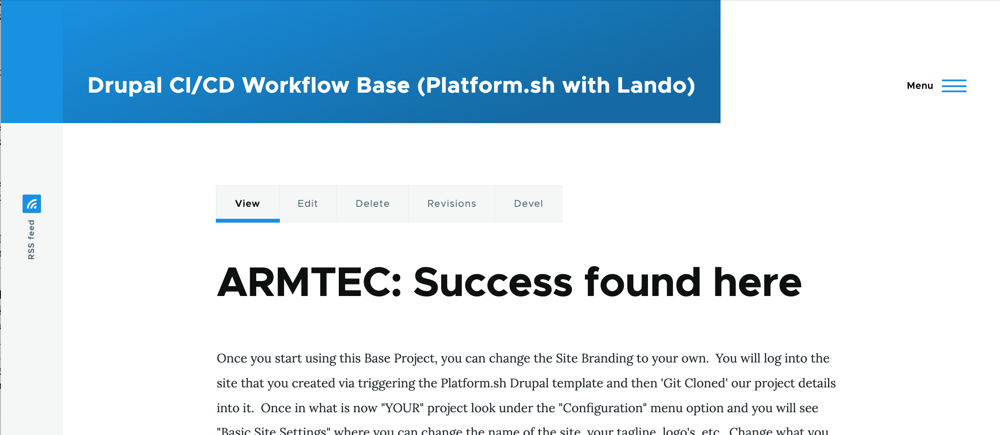
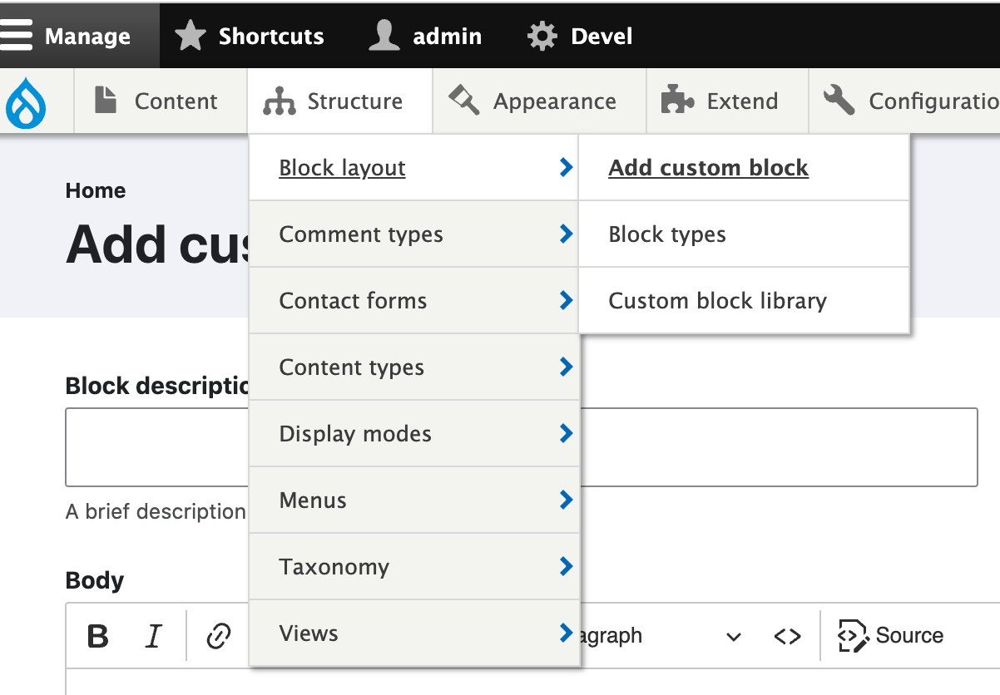
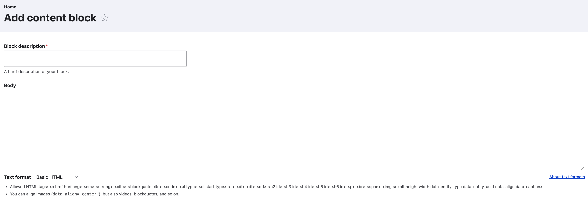
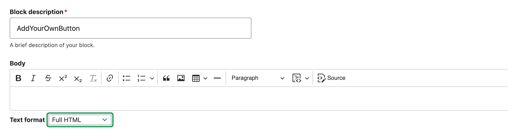
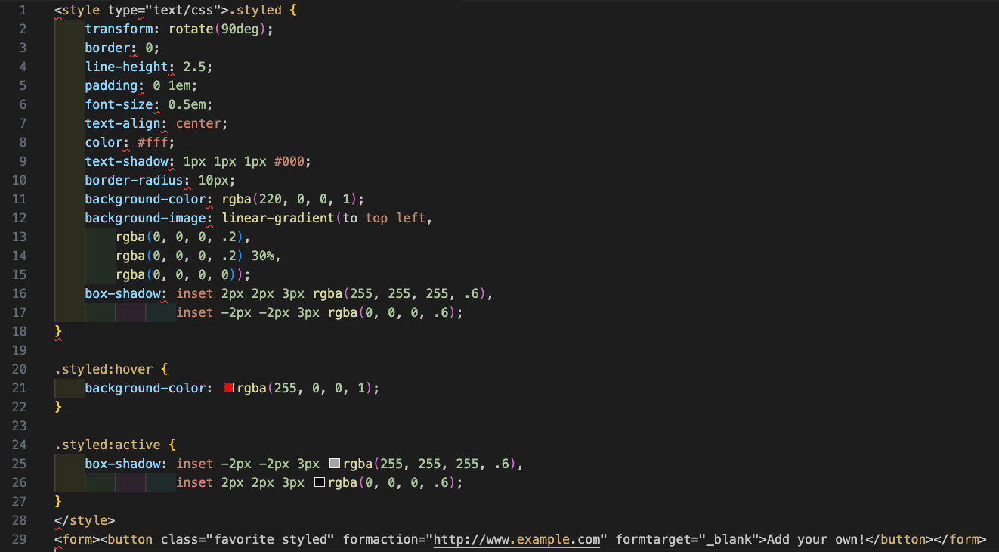
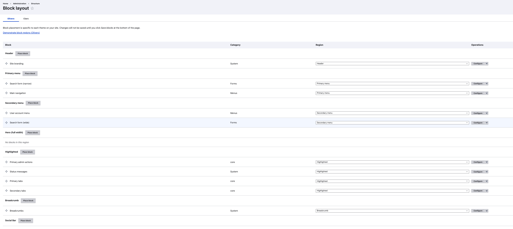

# 'Add Your Own' button

Here is how to create the "Add Your Own" Button & place it in the Social Bar.  A Drupal site with the Olivero theme installed will look something like this.  The Social Bar is on the left side where you see the RSS Feed.



As we set it up, you might to direct it to "google's URL" as the link to test it; the css code lists 'www.example.com'.  The key depends on your objective in terms of where you want the button to send people.  An example might be that you have a travel site and you want people to be able to add their own submissions; in which case you might point the button to a Content Type submission form you have set up all the fields of information you want to get from them as input.  And you might then just have it sit as 'unpublished' content until you have reviewed it.  You might even set up a specific workflow.  The node that it  points to will be built and added to over time as it takes submissions.  

### Making the button

We are going to make our button as a custom block and it will be in the custom block library for us to ultimately "place" it (e.g. put in the [region](https://www.drupal.org/docs/user_guide/en/block-regions.html) of our layout where we want it).

First we need to make our custom block.  Go to Administration/Structure/Block layout/ and choose Add custom block. 



In that custom block library we hit "add" and give our block a name; something with the name of a button would make sense.   Remember, that each time you want to work on your button you will find its name on the list and hit the "edit" option.  You might want to change its size, color, font style, label, etc.

After you choose add or when you choose edit you will see a screen that looks like this.  The key is to go down to the box below the Body where it says "Text Format" and select "Full HTML" from the options on the pulldown. 



Here the example has been given the Block description of "AddYourOwnButton" to be easily identified later from our list.  And you can see the Text format has been changed to "Full HTML".  Note the "Source" icon on the Body section menu and click it.



Since this is an 'edit' view, we already see the button but how we make it is with HTML code and we are going to look at that.

You hit the "Source" button in the upper right of the Body area and this is where you place the HTML code to do stuff.  In our case, since it is a button that doesn't have a bunch of graphical interface with other elements of our website, just within the 'region' we place it, we are going to <style> the look of the button right within a leading chunk of inline CSS code.

Here is the code you want to use for the button.  It is first presented in an image which may be more readable. 



The code itself is available right below so it can just be copied from this documentation and dropped in the 'Body' area:

```
<style type="text/css">.styled {
    transform: rotate(90deg);
    border: 0;
    line-height: 2.5;
    padding: 0 1em;
    font-size: 0.5em;
    text-align: center;
    color: #fff;
    text-shadow: 1px 1px 1px #000;
    border-radius: 10px;
    background-color: rgba(220, 0, 0, 1);
    background-image: linear-gradient(to top left,
                                      rgba(0, 0, 0, .2),
                                      rgba(0, 0, 0, .2) 30%,
                                      rgba(0, 0, 0, 0));
    box-shadow: inset 2px 2px 3px rgba(255, 255, 255, .6),
                inset -2px -2px 3px rgba(0, 0, 0, .6);
}

.styled:hover {
    background-color: rgba(255, 0, 0, 1);
}

.styled:active {
    box-shadow: inset -2px -2px 3px rgba(255, 255, 255, .6),
                inset 2px 2px 3px rgba(0, 0, 0, .6);
}
</style>
<form><button class="favorite styled" formaction="http://www.google.com" formtarget="_blank">Add your own!</button></form>
```

<br>

The button that makes up the code won't show up on your website until you 'place' the custom block you made.  To do that you go into "Administration/Structure/Block Layout" from tool bar and you will see all the regions you have in your site. 



Scroll down to the region called 'Social Bar' and hit the "Place Block" button; where upon you will see a list of the blocks available.  You named this block when you set it up as your own version of "Add Your Own Button", so select the block you names.  It may drop in below the RSS Feed that is a standard item in this region but all you need to do is drag and drop it above that with the Maltese cross looking symbol.


<br>
<br>
<br>

[Learn More - CMS Front-end](../chapters.md#front-end)

