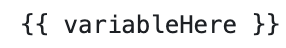
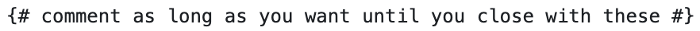

# TWIG

TWIG is termed a 'templating engine'; fancy way of saying something needs to paint your PHP variable in Drupal into the HTML that browsers understand.  TWIG actually allows HTML to be used directly in its templates.  Plus, it reads the variables from your Drupal PHP code and spits it back out as HTML.  Easiest way to see this is to look at a VSCode IDE editor extension which [shows the TWIG template on the left pane and the resulting HTML in the right pane (if you are if a rush about 27 seconds in)](https://www.youtube.com/watch?v=P10QBhoFgEs).  Don't automatically take the visual showing this comparison as the best tool for working with TWIG templates in your front-end work; there are many options    There is an ['xdebug' extension that can be added to your VSCode Integrated Development Environment](https://marketplace.visualstudio.com/items?itemName=xdebug.php-debug).

## Sub-theming

One of the key things to understand is that you are pretty unlikely to start out by writing TWIG templates yourself.  Rather, you are most likely to install an existing Drupal theme which has a bunch of TWIG templates that define it.  What you are probably going to want to do is to create a sub-theme from one of these already available themes and then just edit those parts of it you want to customize. Here is [how to set up your sub-theme](https://www.drupal.org/docs/theming-drupal/creating-sub-themes#:~:text=Sub%2Dthemes%20are%20just%20like,organized%20however%20you%20see%20fit.)

The highlights of what need to be done are:
  -  Under the 'themes' sub-directory, create an additional sub-directory with whatever you want to call your theme (e.g. 'mytheme')
  -  In that my-theme sub-directory make a file called 'my-theme.info.yml' and another called 'my-theme.libraries.yml'

That 'my-theme.info.yml' is basically going to tell your system what parent theme it is referencing, what 'regions' your website contains (likely all or a subset of the parent's), and the libraries location and file sames (typically the css and js file locations and components).  As you work on your site, you might need to jump back into that file to update this library information if you start adding extra css and js files beyond the main style sheet.   

## Edit TWIG Templates

ARMTEC, Inc. documentation includes a section on [Continuous Integration/Continuous Deployment (CI/CD) Workflow](../cicd/cicdoverview.md) and if you use that base, this key step is already established.  However, one of the really important things you need to know is that when you are building a sub-theme, it is pretty common that you copy but rename one of the parent theme's TWIG templates to handle some specific page or content type need unique to your own site.  But you also need to worry about how the heck Drupal will know about this customized or edited template.  The way this happens is that you use naming suggestions which Drupal offers up if you turn on [theme debugging](../cicd/envsettings.md#whats-this-twig-stuff).  Here is a [video overview of theme theme debugging](https://www.youtube.com/watch?v=rRsOxSuJ4OU) and it also shows how to disable the 'cache' so you don't need to keep doing this manually as you work on your website.  Note that ARMTEC, Inc.'s CI/CD Workflow process already does this and much more; so it is obviously the recommended way to go.

One of the other things you may need to know to edit this TWIG template copy you have in your sub-theme is what variables it has from your Drupal system available to it.  For the most part people who build solid base themes that you might copy have already done a very good job of indicating this in the documentation right in the TWIG template itself.  So your first stop is just to read that.  If your underlying website added modules which might have made other variables potentially available for your use in a template, there are [additional method available to discover and inspect variable available to the TWIG templates](https://www.drupal.org/docs/theming-drupal/twig-in-drupal/discovering-and-inspecting-variables-in-twig-templates).

## TWIG Syntax

TWIG was added to Drupal for both a security benefit of isolation from direct PHP and for its comparative simplicity.  As noted, TWIG is going to grab information from the database and PHP with an aim to render it in HTML.  Plus, if you look at a TWIG template you will see a whole bunch of it is extremely similar to HTML itself; easing use by those already familiar with front-end website code.  TWIG basically adds only three basic things with this syntax:

  - Grabbing a variable to display...<br>
         
  - Running simple logic...<br
         
  - Allowing you to comment the code...<br>
         

By the way, if you notice in the first two of these there is a capital letter in the second part; this is known as [CamelCase](https://www.techtarget.com/whatis/definition/CamelCase#:~:text=What%20is%20CamelCase%3F,humps%20on%20a%20camel's%20back.).  This is the common style of nomenclature used with TWIG.  Don't get overly wrought over it.  It is just a fancy way to make variables with longer and thus unique names easier to read.

## TWIG Basics

Obviously you need to know a few more things about reading, editing, or writing TWIG code if you are going to modify TWIG Templates provided by your base theme.  Some of the real basics are not much more difficult than knowing the variables available as discussed above. In addition to [grabbing those variables, to apply the logic to them you probably should review this basic overview](https://symfonycasts.com/screencast/twig/basics).  Then Selwyn Polit's online Drupal book is a good reference to [work with TWIG code](https://selwynpolit.github.io/d9book/twig.html).  You can also go to the source by reviewing [TWIG for Template Designers
](https://twig.symfony.com/doc/3.x/templates.html) right on the Symfony documentation site. 

## TWIG Tweak

`composer require drupal/twig_tweak`
`drush en twig_tweak`

[Practice trial TWIG edit approaches](TwigFiddle.com)

[Twig Tweak Cheatsheet](https://git.drupalcode.org/project/twig_tweak/-/blob/3.x/docs/cheat-sheet.md)

[Twig Tools and Pattern Lab component linking](https://www.videodrupal.org/video/20210127/integrating-components-drupal-mapping-fields)

[How do you place a block in a Twig template](https://befused.com/drupal/twig-block/)


## TWIG Editing

Once you are past the faint at heart stage doing minor things to some of the templates you have copied from your base theme, pasted in your custom theme, and renamed to your unique use, you might want to take on something a little more challenging to really get a feel for working with TWIG editing, nodes and views you have created in your Drupal project, and move to the next level.  Here is an [example of Nodes, Views, and Layout actions you can take in TWIG](https://www.youtube.com/watch?v=sP5fzEBEWlM).


Run this code block from your terminal CLI and it will add more context specific alternative template suggestions for the node twig template you want to customize.

```
<?php

function mytheme_theme_suggestions_page_alter(array &$suggestions, array $variables) {
  // Add very specific content type suggestions
  if (\Drupal::routeMatch()->getRouteName()== 'entity.mode.canonical') {
    $node = \Drupal::routeMatch()->getParameter( parameter_name: 'node');
    array_splice( &input: $suggestions, offset: 1, length: 0, replacement: 'page_node' . $node->getType());
  }
}
```

<br>
<br>

Run this code block which invokes 'view' such that any variable we add, like our node with hero content, it is rendered as just part of the normal display process.
```
/**
* Implements hook_preprocess_page() for PAGE document templates.
*/
function simple_preprocess_page(&$variables) {
  if (!empty($variables['node'])) {
    $node = $variables['node'];
   
    $her_content = $node->get('field_landing_hero')->view();
    if (!empty($hero_content)) {
      $variables['hero_content'] = $hero_content;
    }
  }
}
```

We are going to use a template named:
node--landing-page--full.html.twig

We need to use this preprocess code to attach the article list to that node template.
```
// Add the article list to the landing page node template.
function simple_preprocess_node(&$variables) {
  $node = $variables['node'];|
  
  if($node->getType() == 'landing_page') { 
    $item = $node->get('field_page_temp')->getValue();
    $tid = $item[0]['target_id'];
    $variables['content']['article_list'] = views_embed_view(name: 'landing_page_articles', display_id 'embed_1, $tid;)
  }
}
```


[EXAMPLE CONNECTING PHP TO THEME YMAL AND TWIG THAT SHOWS USE OF HOOKS](https://www.youtube.com/watch?v=AXtozyHIa040)


Wow!  As usual "you the man".  Love your advice and it makes sense.  Bootstrap 4 Barrio seems so capable at the TWIG level.  And I have both made copies of those TWIG templates to modify them in my custom theme and I have added CSS to make further adjustments. The key is that I am probably pretty unskilled at it and thought I might be able to benefit from the components in Olivero to speed things up. But them when I started looking at what I would have to do to build the 'functional' elements I wanted to add to Olivero I headed your way for that key wisdom (Barrio -> Olivero, not Olivero -> Barrio).

I want to see if I am correctly understanding something else about this overall process.  At the foundational level, PHP itself has some potential to 'theme'; and before Drupal 8 that was in fact where some level of it was done.  At the PHP level there are variables and in TWIG based Drupal, TWIG starts by addressing those variables and then doing something with them [if this first step is correct, is there a good way or tool to dump what PHP variables are most logically brought into TWIG for then further theming].    Within TWIG there isn't too much you do to 'make it pretty' but that is where you might apply logic like any looping or functional manipulation that would benefit a theme.  But it is also within TWIG that you are to write your HTML that might hardcode something into the template while the template also grabs what is being pulled from the database to be presented.  The HTML is where you are preparing the first level 'display' characteristics of the presentation so you are defining a 'card', a 'grid', an 'accordion', 'checkboxes', 'radio buttons', etc. with that code; and most importantly defining 'class'.  Then CSS generally is adding color, location, size, font style, and the 'pretty' aspects to the final presentation.    [please let me know if this is correct or where it is goofed up].

Assuming I am reasonably on track with the above, then the balancing act becomes how one might think about the HTML portion in the Layout Builder world.  If I was going to write native HTML I would be all worried about the DIV stacking so one part of the code isn't stepping on the next.  But is it reasonable to assume that with Layout Builder you are assembling the blocks you have defined into a node and after you have it generally laid out using that tool you could look at the code in the developer view in your browser and you would see all the DIVs, Classes, IDs, etc. all ready generated; thus allowing you to tweak with CSS by addressing them at that point to make any final customization you desire?

I am hoping to get a broad handle on all the interconnections with the thought that I might copy, paste, and edit some components from one theme  to a totally different theme.  Like if I want to to grab some features I really like from Olivero and put them in Bootstrap.  I really like Olivero's site-style logo & image contraction upon scroll and the menu approach and responsive presentation.  So that is mainly what I want to try to recreate.  Color schemes, and font styles, etc. are easy to make it look like that.  But I am thinking the core parts I like are doing to be much harder to figure out how they have set up because I suspect it is an interworking of PHP pass of the title, image and slogan fields to TWIG and then not only HTML and CSS but may involve JS to try to figure out.  But, if my description about how all these connect are generally on track, then it will be good practice to work on this.

Any place you know of that outlines 'best practices' on how you approach interconnecting these moving parts?  Seems like Drupal allows so many ways I could approach it.  But experienced people must has some principles they tend to stick to so others can work on their code later.

Drupal 8+. In earlier versions of Drupal, you were able to insert PHP into theme files (the .tpl.php files) because of the theming “engine” that was being used. When Drupal 8 switched to Symphony, the theming engine was replaced with TWIG. Part of the reason was because TWIG is more code agnostic than what was used in earlier versions of Drupal, but also because it is a HUGE security risk to put PHP in the theme layer, because that is what gets executed last on a site. So any code in a .tpl.php file (or more likely the template.php file) was a big risk.  TWIG basically acts as an intermediary between PHP and the front end layer, by allowing you to perform simpler operations (if statements, loops, variables) without the need for full blown PHP functions. Therefore, you can have front end people working on the theme without opening security holes, but also giving you access to the more commonly used elements of PHP. That being said, you CAN still execute PHP in a theme, it is just relegated to the .theme file in your theme. This is mostly for setting theme wide variables that PHP interacts with but also for doing pre and post process steps. If you look at Barrio you will see a lot of what they do on the theme is contained in that because it was the easiest way to bring in Bootstrap 4 functionality to Drupal.

There is nothing wrong with copying over some of the functionality that you like from Olivero (or whatever) to your theme, I would just caution that you understand how the TWIG files are setup when you are copying - there are likely other variables that get referenced within the theme that you need to track down and then recreate in yours to get the full functionality. I would also say that a lot of Olivero may just be accomplished through modern CSS, though I honestly haven’t played with it in a while so I can’t remember. With a little bit of trial and error though, you should be able to recreate your desired effects through copying the TWIG files and mimicking the CSS in there.



<br>
<br>
<br>

[Learn More - CMS Front-end](../chapters.md#front-end)
