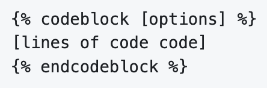

# TWIG

TWIG is termed a 'templating engine'; fancy way of saying something needs to paint your PHP variable in Drupal into the HTML that browsers understand.  TWIG actually allows HTML to be used directly in its templates.  Plus, it reads the variables from your Drupal PHP code and spits it back out as HTML.  Easiest way to see this is to look at a VSCode IDE editor extension which [shows the TWIG template on the left pane and the resulting HTML in the right pane (if you are if a rush about 27 seconds in)](https://www.youtube.com/watch?v=P10QBhoFgEs).  Don't automatically take the visual showing this comparison as the best tool for working with TWIG templates in your front-end work; there are many options    There is an ['xdebug' extension that can be added to your VSCode Integrated Development Environment](https://marketplace.visualstudio.com/items?itemName=xdebug.php-debug).

## Sub-theming

One of the key things to understand is that you are pretty unlikely to start out by writing TWIG templates yourself.  Rather, you are most likely to install an existing Drupal theme which has a bunch of TWIG templates that define it.  What you are probably going to want to do is to create a sub-theme from one of these already available themes and then just edit those parts of it you want to customize. Here is [how to set up your sub-theme](https://www.drupal.org/docs/theming-drupal/creating-sub-themes#:~:text=Sub%2Dthemes%20are%20just%20like,organized%20however%20you%20see%20fit.)

The highlights of what need to be done are:
  -  Under the 'themes' sub-directory, create an additional sub-directory with whatever you want to call your theme (e.g. 'mytheme')
  -  In that my-theme sub-directory make a file called 'my-theme.info.yml' and another called 'my-theme.libraries.yml'

That 'my-theme.info.yml' is basically going to tell your system what parent theme it is referencing, what 'regions' your website contains (likely all or a subset of the parent's), and the libraries location and file sames (typically the css and js file locations and components).  As you work on your site, you might need to jump back into that file to update this library information if you start adding extra css and js files beyond the main style sheet.   

## Edit TWIG Templates

ARMTEC, Inc. documentation includes a section on [Continuous Integration/Continuous Deployment (CI/CD) Workflow](../cicd/cicdoverview.md) and if you use that base, this key step is already established.  However, one of the really important things you need to know is that when you are building a sub-theme, it is pretty common that you copy but rename one of the parent theme's TWIG templates to handle some specific page or content type need unique to your own site.  But you also need to worry about how the heck Drupal will know about this customized or edited template.  The way this happens is that you use naming suggestions which Drupal offers up if you turn on [theme debugging](../cicd/envsettings.md#whats-this-twig-stuff).  Here is a [video overview of theme theme debugging](https://www.youtube.com/watch?v=rRsOxSuJ4OU) and it also shows how to disable the 'cache' so you don't need to keep doing this manually as you work on your website.  Note that ARMTEC, Inc.'s CI/CD Workflow process already does this and much more; so it is obviously the recommended way to go.

One of the other things you may need to know to edit this TWIG template copy you have in your sub-theme is what variables it has from your Drupal system available to it.  For the most part people who build solid base themes that you might copy have already done a very good job of indicating this in the documentation right in the TWIG template itself.  So your first stop is just to read that.  If your underlying website added modules which might have made other variables potentially available for your use in a template, there are [additional method available to discover and inspect variable available to the TWIG templates](https://www.drupal.org/docs/theming-drupal/twig-in-drupal/discovering-and-inspecting-variables-in-twig-templates).

## TWIG Syntax

TWIG was added to Drupal for both a security benefit of isolation from direct PHP and for its comparative simplicity.  As noted, TWIG is going to grab information from the database and PHP with an aim to render it in HTML.  Plus, if you look at a TWIG template you will see a whole bunch of it is extremely similar to HTML itself; easing use by those already familiar with front-end website code.  TWIG basically adds only three basic things with this syntax:

  - Grabbing a variable to display...<br>
         
  - Running simple logic...<br>
         
  - Allowing you to comment the code...<br>
         

By the way, if you notice in the first line showing a variable that there is a capital letter in the second part; this is known as [CamelCase](https://www.techtarget.com/whatis/definition/CamelCase#:~:text=What%20is%20CamelCase%3F,humps%20on%20a%20camel's%20back.).  This is a common style of nomenclature used with TWIG.  Don't get overly wrought over it.  It is just a fancy way to make variables with longer, and thus unique, names easier to read.

## TWIG Basics

Lets put the [use of TWIG in easy context with how you first get the basics set up with the Drupal GUI where you have set up a new content type](https://www.youtube.com/watch?v=BCEovMcvWX0).  Once you have down those basics, you are probably ready to turn to more advanced edits [of your TWIG templates, especially the various 'logic' options](https://www.youtube.com/watch?v=S0oJGy4a65Q).  After you view that video and start to feel comfortable, you might try [practicing TWIG editing online](https://twigfiddle.com/) to see how you are doing.

We discussed earlier discovering the available variables.  In addition to [grabbing those variables you will want to learn the basics of applying code logic to them](https://symfonycasts.com/screencast/twig/basics).  Then Selwyn Polit's online Drupal book is a good reference to [work with TWIG code](https://selwynpolit.github.io/d9book/twig.html).  You can also go to the source by reviewing [TWIG for Template Designers](https://twig.symfony.com/doc/3.x/templates.html) right on the Symfony documentation site. 

<br>
<br>

## TWIG Tweak

Some people who are developers experienced in the templating approach before TWIG feel like they gave up some power with its adoption by Drupal in version 8 forward and [want to leverage approaches to TWIG extentions](https://www.youtube.com/watch?v=kEy89A0rpkQ).  One of those approaches is a contributed module called TWIG Tweak..

`composer require drupal/twig_tweak`
`drush en twig_tweak`

TWIG Tweak adds access to additional variables that might not be shown in the documentation in the templates you got from your parent theme; perhaps some global system variables you want to use.  It also offers you some additional controls of TWIG code logic you might apply.  A first peek at the use of [TWIG Tweak might be to use it to place a 'block' in a TWIG template](https://befused.com/drupal/twig-block/).   TWIG Tweak exposes a number of [additional functions and filters that add power to what your templates can accomplish
](https://www.droptica.com/blog/enhanced-drupal-templates-review-twig-tweak-module/).


[Twig Tweak Cheatsheet](https://git.drupalcode.org/project/twig_tweak/-/blob/3.x/docs/cheat-sheet.md) offers you a quick reminder to turn to as you work.

<br>
<br>


## TWIG & Preprocessing

Once you are past the faint at heart stage doing minor things to some of the templates you have copied from your base theme, pasted in your custom theme, and renamed to your unique use, you might want to take on something a little more challenging to really get a feel for working with TWIG editing, nodes and views you have created in your Drupal project, and move to the next level.  Here is an [example of Nodes, Views, and Layout actions you can take in TWIG](https://www.youtube.com/watch?v=sP5fzEBEWlM).

For convenient use in following along with the recommended steps in the video, 

the code blocks below are provided.  You run these from your terminal CLI.   This first block will add more 'context specific' alternative template suggestions for the node twig template being customized.

```
<?php

function mytheme_theme_suggestions_page_alter(array &$suggestions, array $variables) {
  // Add very specific content type suggestions
  if (\Drupal::routeMatch()->getRouteName()== 'entity.mode.canonical') {
    $node = \Drupal::routeMatch()->getParameter( parameter_name: 'node');
    array_splice( &input: $suggestions, offset: 1, length: 0, replacement: 'page_node' . $node->getType());
  }
}
```

<br>
<br>

Run this code block which invokes 'view' such that any variable we add, like our node with hero content, it is rendered as just part of the normal display process.
```
/**
* Implements hook_preprocess_page() for PAGE document templates.
*/
function simple_preprocess_page(&$variables) {
  if (!empty($variables['node'])) {
    $node = $variables['node'];
   
    $her_content = $node->get('field_landing_hero')->view();
    if (!empty($hero_content)) {
      $variables['hero_content'] = $hero_content;
    }
  }
}
```

The context specific template being added is named:
`node--landing-page--full.html.twig`

You need to use this 'preprocess code' to attach the article list to that node template.
```
// Add the article list to the landing page node template.
function simple_preprocess_node(&$variables) {
  $node = $variables['node'];|
  
  if($node->getType() == 'landing_page') { 
    $item = $node->get('field_page_temp')->getValue();
    $tid = $item[0]['target_id'];
    $variables['content']['article_list'] = views_embed_view(name: 'landing_page_articles', display_id 'embed_1, $tid;)
  }
}
```
<br>

Hope you enjoyed this more advanced example and want to learn more about [data processing concepts in drupal theming
](https://mycode.blog/lakshmi/data-processing-concepts-drupal-theming).

<br>
<br>
<br>

[Learn More - CMS Front-end](../chapters.md#front-end)

